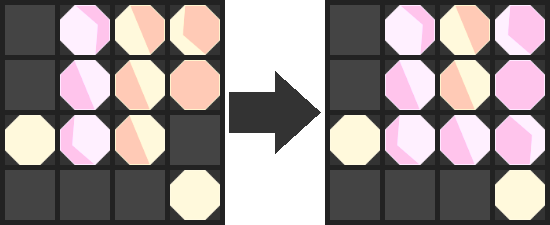

# LunaReversi

LunaReversi is a strategic board game that combines the classic mechanics of Reversi/Othello with lunar phases, where players compete to control the board through clever placement of moon phase tiles.

## 🎮 Game Modes

The game features 13 unique modes, each with special mechanics:
- **Blue Moon**: Classic gameplay mode
- **Wolf Moon**: Simultaneous placement mechanics
- **Snow Moon**: Row/column phase restrictions
- **Worm Moon**: Hidden hazards
- **Pink Moon**: Dynamic playable board area
- **Flower Moon**: Limited piece duration
- **Strawberry Moon**: Planet rotation mechanics
- **Buck Moon**: Phase locking mechanics
- **Sturgeon Moon**: Board rotation mechanics
- **Corn Moon**: Piece movement instead of placement
- **Hunter's Moon**: Limited visibility of opponent pieces
- **Beaver Moon**: Special full/new moon effects
- **Cold Moon**: Moving comet hazards

## 🎯 How to Play

1. Select a game mode from the main menu
2. Players take turns placing moon phase tiles on the board
3. Capture opponent's pieces by creating valid phase sequences
4. The player with the most pieces when the game ends wins



## 🛠️ Built With
- React
- TypeScript
- CSS

## 📝 Game Rules

### Basic Mechanics
- Players alternate turns placing moon phase tiles
- Pieces can capture in straight lines by following moon phase progression
- Different game modes add unique twists to these basic mechanics

### Scoring
- Each piece on the board is worth 1 point
- Some modes have special scoring conditions
- The player with the highest score when the game ends wins

## 🚀 Getting Started

### Prerequisites
- Node.js (v14 or higher)
- npm or yarn

### Installation
1. Clone the repository
```bash
git clone https://github.com/StokesMatthew/luna-reversi.git
cd luna-reversi
```

2. Install dependencies
```bash
npm install
# or
yarn install
```

3. Start the development server
```bash
npm start
# or
yarn start
```

The game will be available at `http://localhost:3000`

## 🔧 Development

### Project Structure
```src/
├── components/     # React components
├── utils/         # Utility functions
└── types/         # TypeScript definitions
```

### Available Scripts
- `npm start` - Run development server
- `npm test` - Run test suite
- `npm run build` - Build for production